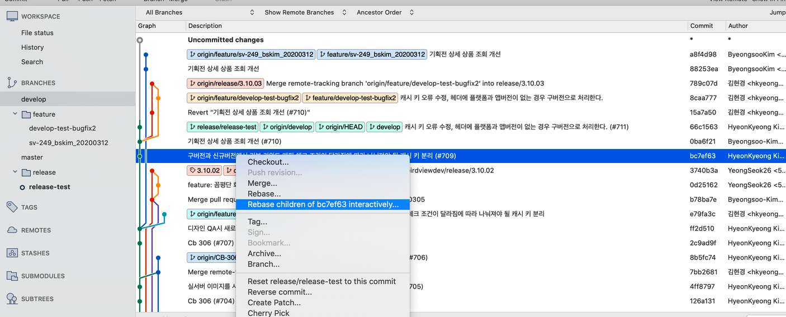

# Overview
두 a/b feature branch가 develop branch에 머지 되었고 아직 개발이 완료되지 않은 b feature를 제외시키고 release branch를 만드려고 한다 
여기에서 활용할 방법은 git rebase interactive!!

# 구체적인 develop 브랜치 상황

현재 develop 브랜치는 bc7ef63(a feature) → 0ba6f21(b feature) → 66c1563(a feature) 순으로 커밋되어 있고, 여기에서 a feature 커밋만 배포되길 원한다

# release 브랜치에서 특정 커밋 제외

이 예제에서는 bc7ef63(a feature) → 0ba6f21(b feature) → 66c1563(a feature) 구성되어 있는 develop에서 release 브랜치를 생성하고, release에서 특정 브랜치(b feature)를 제외시키겠다

1. develop 브랜치에서 release-test 생성

    

2. release 브랜치에서 bc7ef63(a feature)로 rebase interactive를 실행한다
**bc7ef63(b feature)로 rebase interactive를 하는 이유는,** rebase interactive는 sub-command로 여러가지 작업을 할 수 있는데 그중에 bc7ef63(a feature)전까지의 커밋들중 0ba6f21(b feature)을 지우기 위해서이다
참고) rebase interactive 상세 내용 : [https://jupiny.com/2018/05/07/git-rebase-i-option/](https://jupiny.com/2018/05/07/git-rebase-i-option/)

    

3. 0ba6f21(b feature)을 커밋을 삭제한다

    

4. 새롭게 커밋된 release가 처음과 다르게(1번 참조) bc7ef63(a feature)에서 브랜치가 분기되고 0ba6f21(b feature) 커밋은 빠지고 66c1563(a feature) 커밋은 추가된걸 확인 할수 있다

    

    
